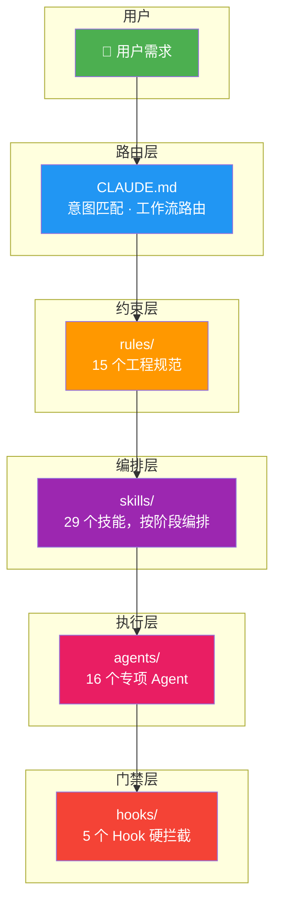
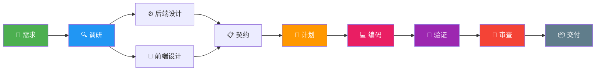
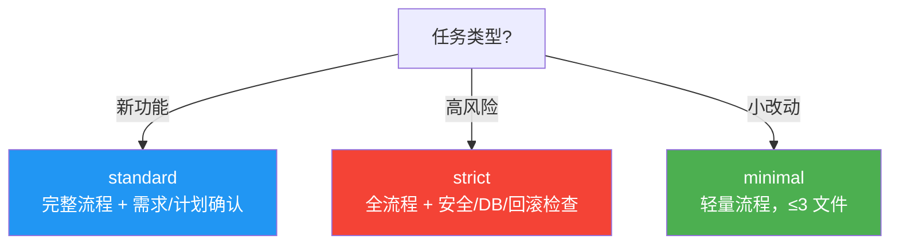
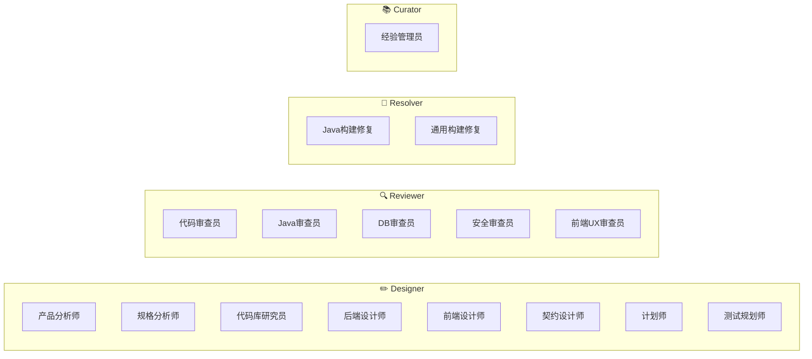

# ShipKit · 舰桥

<p align="center">
  
</p>

<p align="center">
  <strong>从产品想法到代码交付的 AI 工程工作流</strong><br>
  把团队规范固化到 Claude Code 配置中，让 AI 自动走完全流程——需求分析、设计、编码、验证、审查、交付。
</p>

<p align="center">
  <a href="#快速开始">快速开始</a> ·
  <a href="#它能做什么">它能做什么</a> ·
  <a href="#工作原理">工作原理</a> ·
  <a href="#工作流家族">工作流</a> ·
  <a href="#安装">安装</a>
</p>

---

## 它能做什么

你只需要说出需求，AI 自动匹配工作流、拆分阶段、产出文档、编码、跑测试、出审查报告——每个阶段有对应角色确认，每行代码有门禁拦截。

<table>
<tr>
<td width="50%">

### 给开发者

- **一句话开始工作**。说"帮我做个功能"，AI 自动走全流程
- **不用记规范**。团队规范自动加载，编码即合规
- **自动化验证**。独立 Agent 跑测试、出报告，不自己骗自己
- **上下文不丢**。`/clear` 后自动恢复工作进度

</td>
<td width="50%">

### 给团队

- **统一工作流**。每个需求走同样的分析→设计→编码→验证→审查
- **角色化确认**。产品确认 PRD，技术确认规格，负责人确认开工
- **硬性门禁**。危险命令拦截、未确认不允许改代码、不允许超出计划范围
- **经验沉淀**。每次交付自动提取可复用模式，跨项目晋升为规则

</td>
</tr>
</table>

---

## 快速开始

**前提**：[Claude Code CLI](https://docs.anthropic.com/en/docs/claude-code) 已安装，Python 3 可用。

```bash
git clone https://github.com/minghaoZhangZ/shipkit.git
cd shipkit
claude
```

在 Claude Code 中输入：

```
按 SETUP.md 执行安装
```

AI 自动备份、复制、合并配置、验证。**你的 API 配置完全不动。**

装好后，在任何目录试试：

```
帮我修复一个单词拼写错误
```

AI 自动走 quick-fix-flow：创建 change workspace → 代码调研 → 修复 → 验证。

---

## 工作原理



四层架构各司其职：

| 层 | 做什么 | 一句话 |
|----|--------|--------|
| **约束层** · rules/ + CLAUDE.md | 定义"AI 应该怎么做" | 编码风格、架构边界、安全规则 |
| **编排层** · skills/ + profiles/ | 定义"AI 走哪个流程" | 需求分析→设计→计划→编码→验证→审查→交付 |
| **执行层** · agents/ | 定义"谁来做" | 16 个专项 Agent，各司其职 |
| **门禁层** · hooks/ | 定义"什么不能做" | 危险命令阻断、checkpoint 确认、范围控制、文件名规范、工程规范前缀校验 |

---

## 工作流家族

CLAUDE.md 自动路由，你不需要手动选择：

| 你的意图 | 自动匹配 | 适用场景 |
|---------|---------|---------|
| 新功能、需求开发 | `product-to-test-flow` | 普通产品需求，有前后端/契约变更 |
| 高风险操作 | `strict-product-to-test-flow` | 安全、金钱、订单、数据迁移、并发、外部集成 |
| 小 bug、单文件改动 | `quick-fix-flow` | 拼写错误、小 UI 修复、≤3 文件 |
| 构建/测试报错 | `build-fix-flow` | 编译失败、lint 报错、依赖缺失 |
| 代码审查 | `review-flow` | PR 审查、变更后审查 |
| 验证已完成的改动 | `verification-flow` | 独立验证实现是否正确 |
| 提取经验教训 | `learn-from-delivery` | 需求完成后总结可复用经验 |

### 全流程主链路



### 阶段、产出、确认角色

| 阶段 | 产出 | 谁确认 |
|------|------|--------|
| 需求 | `00_原始需求.md` | — |
| PRD | `01_PRD产品需求.md` | 产品/业务负责人 |
| 工程规格 | `02_工程需求规格.md` | 技术负责人 |
| 代码调研 | `03_代码库调研.md` | — |
| 后端设计 | `04_后端方案说明.md` | 后端 Owner |
| 前端设计 | `05_前端方案说明.md` | 前端 Owner |
| 接口契约 | `06_接口与数据契约.md` | 前后端 Owner |
| 实施计划 | `07_实施计划.md` + `08_验证计划.md` | 研发负责人 |
| 编码 | 业务代码 + 测试代码 | —（TDD 循环） |
| 验证 | `09_验证结果.md` | —（独立 Agent 执行） |
| 审查 | `11_审查报告.md` | — |
| 交付 | `12_发布说明.md` + `13_经验沉淀.md` | — |
| 归档 | 归档到 archive/ | — |

> 每个确认点未通过前，Hook 硬拦截业务代码修改——只能写设计文档，不能改代码。

### Profile 三级



| | minimal | standard | strict |
|------|---------|----------|--------|
| 文件改动 | ≤3 | 不限 | 不限 |
| 人工确认 | 无 | 需求+计划 | 全部 6 个确认点 |
| 验证深度 | 目标测试 | 构建+全量测试 | +安全+DB+回滚 |
| 审查 | 自检 | 独立 Agent | 独立 + 专项审查 |
| 经验沉淀 | 不强制 | 必须 | 必须 |
| **自动升级** | — | 检测到权限/事务/DB/契约变更 → 升级标准 | 检测到安全/金钱/订单/迁移 → 升级严格 |

---

## Agent 体系



| 角色 | 能做什么 | 不能做什么 |
|------|---------|-----------|
| **Designer** (8个) | 读代码、读需求、写设计文档 | 改业务代码 |
| **Reviewer** (5个) | 读代码、读 diff、写审查报告 | 改业务代码 |
| **Resolver** (2个) | 修复构建/编译/lint 错误 | 顺手重构、跳过门禁 |
| **Curator** (1个) | 提取经验、评估 Agent | 改业务代码 |

---

## 门禁系统

5 个 PreToolUse Hook 在每次工具调用前执行：

| # | Hook | 拦截什么 | 触发条件 |
|---|------|---------|---------|
| 1 | `dangerous-command-guard` | `rm -rf`、`DROP TABLE`、`git push -f`、`curl\|sh` 等 17 种危险命令 | 始终 |
| 2 | `checkpoint-guard` | 业务代码修改 + 构建/测试命令 | 确认点未通过 |
| 3 | `scope-guard` | 实施计划允许范围外的文件编辑 | 编码/验证阶段 |
| 4 | `canonical-filename-guard` | 非标准中文文档名 | changes/*/ai/ 下的 .md/.json |
| 5 | `engine-guard` | 未注册规则前缀写入 | engineering/**/*.md |

---

## 编码→验证收敛

```
Round 1: 编码完成 → 独立 Agent 验证
  ├─ 0 失败 → 进审查 ✓
  ├─ P1 失败 (逻辑bug) → 主控修复 → Round 2
  └─ P2 失败 (优化) → 可选修复，不阻断

Round 2: 修复 → 再次独立验证
  ├─ 全部通过 → 进审查 ✓
  ├─ 同一组件又失败 → 设计缺陷 → 回退设计阶段
  └─ 不同组件失败 → 修复 → Round 3

Round 3: 最后一次修复 → 最终验证
  ├─ 全部通过 → 进审查
  └─ 仍有失败 → 强制出口 + 记录 OPEN_ISSUES → 进审查（带风险）

L4: 连续三次 → 强制停止 → 写 PENDING_DECISIONS → 人工介入
```

---

## 项目级工程规范（可选增强）

```bash
# 在项目根目录的 Claude Code 中输入：
初始化团队工程一致性模板
```

AI 在 `openspec/specs/engineering/` 下创建工程规范模板。默认未启用（`enabled: false`），团队审批后开启：

| 模式 | 行为 |
|------|------|
| `advisory` | 记录风险，不阻断 |
| `enforced` | 违规可阻断审查/归档 |

规范文件通过**规则 ID 前缀**（`JAVA-DA-`、`TX-`、`GEN-`）自动发现——不依赖目录或文件名。

---

## 安装

**前提**：[Claude Code CLI](https://docs.anthropic.com/en/docs/claude-code)、Python 3

```bash
git clone https://github.com/minghaoZhangZ/shipkit.git
cd shipkit
claude
```

```
按 SETUP.md 执行安装
```

AI 自动完成全部安装步骤。**API 配置完全不动。**

### 更新

```bash
cd shipkit && git pull
claude
# 输入：重新执行 SETUP.md 安装
```

### 验证

在任何目录输入简单需求试试：

```
帮我修复一个单词拼写错误
```

观察 AI 是否自动创建 change workspace 并走完整流程。

---

## 常见问题

<details>
<summary><strong>会影响我已有的 API 配置吗？</strong></summary>
不会。安装时 <code>env</code> 字段完全不动，你的 API key、代理配置等不受影响。
</details>

<details>
<summary><strong>安装后所有项目都走这套流程吗？</strong></summary>
只在工作目录下有 <code>openspec/</code> 或 <code>.claude/</code> 的项目才会触发完整工作流。其他目录照常工作，但全局规范和 Agent 依然可用。
</details>

<details>
<summary><strong>怎么临时跳过某个确认点？</strong></summary>
在 <code>.workflow_state</code> 中将对应 checkpoint 加入 <code>confirmed_checkpoints</code>。不建议在生产需求中跳过。
</details>

<details>
<summary><strong>能不能只用部分功能？</strong></summary>
可以。只复制 <code>rules/</code>（要规范）、<code>hooks/</code>（要门禁）、<code>agents/</code>（要专项Agent）都行。SETUP.md 是全量安装，也可以手动选择。
</details>

<details>
<summary><strong>怎么卸载？</strong></summary>
删除 <code>~/.claude/</code> 下对应的文件。如果之前有备份的 <code>settings.json</code>，恢复即可。
</details>

---

## 自定义

| 需求 | 做法 |
|------|------|
| 加团队规则 | `rules/` 下新建 `.md` 文件 |
| 调整工作流阶段 | 编辑 `profiles/profiles.json` |
| 换 Agent 模型 | 编辑 `agents/<name>.md` 的 `model:` 字段（sonnet→opus/haiku） |
| 禁用某些 Agent | 从 `profiles.json` 对应 profile 中移除 |
| 项目级规范 | 启用工程一致性治理，写入 `openspec/specs/engineering/` |

---

## 目录结构

```
shipkit/
├── CLAUDE.md                  # 全局 AI 指令 + 工作流路由表 + Spec Discovery
├── ARCHITECTURE.md            # 架构说明文档
├── SETUP.md                   # AI 可读的安装指令
├── settings.shared.json       # 公用配置模板（安装时合并）
│
├── rules/                     # 约束层 · 15 个工程规范
│   ├── spring-core.md
│   ├── architecture/          # 架构证据门、模块边界
│   ├── engineering/           # Java 规范、测试质量
│   ├── frontend/              # UI/UX 质量
│   ├── security/              # 安全审查
│   ├── review/                # Diff 审查
│   ├── product/               # 验收标准
│   ├── workflow/              # 工作流核心规则
│   └── learning/              # 经验沉淀规则
│
├── skills/                    # 编排层 · 29 个技能
│   ├── product-to-test-flow/  # 标准全流程（主技能）
│   ├── quick-fix-flow/        # 轻量修复
│   ├── strict-product-to-test-flow/  # 高风险需求
│   ├── review-flow/           # 代码审查
│   ├── verification-flow/     # 独立验证
│   └── ...                    # 24 个专项技能
│
├── agents/                    # 执行层 · 16 个 Agent 定义
│
├── hooks/                     # 门禁层 · 5 个 Python Hook
│
├── profiles/                  # Profile 定义
├── templates/                 # 工程一致性模板（可选）
├── scripts/                   # 辅助脚本
└── commands/                  # Claude Code 斜杠命令
```
